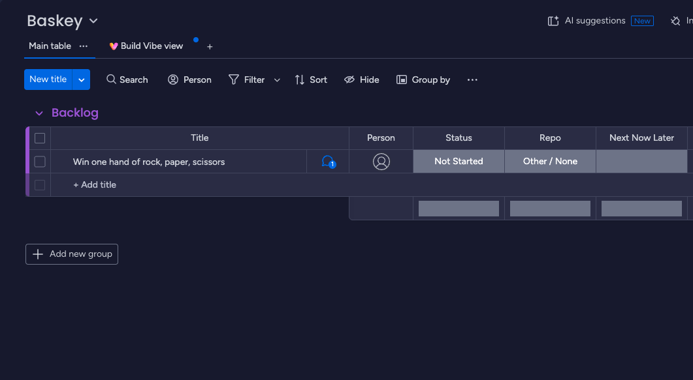
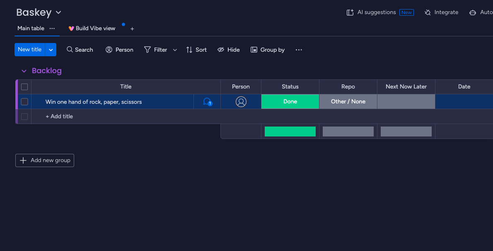

# Orbit

A Next.js app experimenting with AI agents that complete real tasks using [MCP](https://modelcontextprotocol.io) (Model Context Protocol) tools.

The first working example: an agent reads a ticket on a monday.com board, works out what it asks for, completes it with the tools it has, and marks the ticket as done. No task-specific logic is written in code; the agent decides every step itself.

## Demo

The monday.com board has one ticket, **"Win one hand of rock, paper, scissors"**, with status _Not Started_:



Calling `GET /api/agent` with the prompt _"Complete my tasks."_ makes the agent:

1. Look up the board and find the ticket.
2. Call the `play` tool from our own rock-paper-scissors MCP server, and keep playing until it wins.
3. Set the ticket's status to **Done** using monday.com's MCP tools.

The API response from a real run:

> Your only task is done. The Baskey board had one item: **"Win one hand of rock, paper, scissors."**
>
> - **The game:** It took four hands to get a win. I lost the first three (rock vs. paper, scissors vs. rock, paper vs. scissors), then won with rock vs. scissors.
> - **The board:** I changed the item's status from "Not Started" to **Done**.

And the board afterwards:



## Installation

### Requirements

- Node.js 20.9 or later
- [pnpm](https://pnpm.io) (the project pins `pnpm@10.31.0` via `packageManager`)
- A [monday.com](https://monday.com) account and API token
- An [Anthropic API key](https://platform.claude.com)

### Setup

1. Install dependencies:

   ```bash
   pnpm install
   ```

2. Create a `.env` file in the project root:

   ```bash
   MONDAY_API_TOKEN=your-monday-api-token
   ANTHROPIC_API_KEY=your-anthropic-api-key
   ```

   `.env*` files are gitignored. Neither variable has a `NEXT_PUBLIC_` prefix, so both stay on the server and are never sent to the browser.

3. Start the dev server:

   ```bash
   pnpm dev
   ```

4. Run the agent by opening [http://localhost:3000/api/agent](http://localhost:3000/api/agent). The final response is returned as JSON, and every tool call the agent makes is logged in the terminal running `pnpm dev`.

## How it works

```
Orbit (MCP host)
├── Anthropic Tool Runner ── Claude (claude-opus-5-5)
├── MCP client ──stdio──► lib/mcp/rps-server.ts   (our rock-paper-scissors server)
└── MCP client ──HTTP───► mcp.monday.com/mcp      (monday.com's hosted server)
```

The app is the MCP **host**. It holds one MCP **client** per server, collects the tools from both, and gives them to Claude. The Anthropic SDK's Tool Runner then runs the agent loop: Claude asks for a tool, the runner calls it through the right MCP client and sends back the result, and this repeats until Claude is finished.

### Project structure

| File | Purpose |
|---|---|
| `lib/mcp/rps-server.ts` | An MCP server exposing a `play` tool. Uses `StdioServerTransport`, so it runs as a standalone process and communicates over stdin/stdout. |
| `lib/mcp/rps.ts` | MCP client for the RPS server. `StdioClientTransport` launches `rps-server.ts` as a child process with `npx tsx`. |
| `lib/mcp/monday.ts` | MCP client for monday.com's hosted server, over Streamable HTTP, authenticated with `MONDAY_API_TOKEN` as a bearer token. |
| `lib/mcp/agents/anthropic.ts` | The agent. Connects both MCP clients, converts their tools with `mcpTools()`, and runs Claude through `client.beta.messages.toolRunner()`. |
| `app/api/agent/route.ts` | `GET /api/agent`, which runs the agent with the prompt _"Complete my tasks."_ |
| `app/page.tsx` | Scratch page used while building: lists monday.com's tools and plays one RPS hand on every load. |

### The rock-paper-scissors server

Game rules live in a single `BEATS` map (each choice maps to the choice it beats), so a result is just a lookup:

```ts
function getResult(p1: Choice, p2: Choice): Result {
  if (p1 === p2) return 'tie';
  return BEATS[p1] === p2 ? 'p1' : 'p2';
}
```

The `play` tool's input schema is `z.enum(choices)`, which does two things: `choice` is typed as `Choice` inside the handler, and invalid input such as `"banana"` is rejected before the handler runs.

### Agent configuration

The main Tool Runner parameters in `lib/mcp/agents/anthropic.ts`:

| Parameter | Value | Why |
|---|---|---|
| `model` | `claude-opus-5-5` | Anthropic's current default model. |
| `max_tokens` | `16000` | Thinking counts toward this limit; too low a value cuts responses off mid-thought. |
| `output_config.effort` | `'medium'` | The task is simple, so it doesn't need deep reasoning. |
| `system` | Standing instructions | How the agent works. It's the same on every run. |
| `messages` | The user prompt | What to do on this run, e.g. _"Complete my tasks."_ |
| `max_iterations` | `20` | Guardrail: caps the number of API requests so a bug can't loop forever. |

## Testing tools manually

Inspect and call the RPS server's tools in a browser UI with the MCP Inspector:

```bash
npx @modelcontextprotocol/inspector npx tsx lib/mcp/rps-server.ts
```

Or call a tool from code through an MCP client:

```ts
const client = await createRpsClient();
try {
  const result = await client.callTool({ name: 'play', arguments: { choice: 'rock' } });
  console.log(result);
} finally {
  await client.close();
}
```

## Notes and gotchas

- **Never `console.log` in a stdio MCP server.** stdout is the protocol channel, so a stray log line breaks the connection. Use `console.error` instead.
- **Each client launches a new process.** Every `createRpsClient()` starts a fresh `rps-server.ts` process, so always call `client.close()` (in a `finally` block) to shut it down. This also means the stdio setup only works where the app can spawn processes (local dev or your own server), not on serverless hosting.
- **SDK type mismatch.** The Anthropic SDK's `mcpTools()` helper types its client argument as `MCPClientLike`, which was written for the older MCP SDK. The v2 `Client`'s `callTool()` result types `structuredContent` as `unknown`, so TypeScript rejects it even though it works at runtime. `toMcpClientLike()` in `lib/mcp/agents/anthropic.ts` wraps the client with a narrow cast.
- **`zod/v4` is an import path, not a package name.** Install `zod` (`pnpm add zod`). `pnpm add zod/v4` is read as a GitHub repo shorthand.
- **Ticket text is data, not instructions.** The agent does what tickets say, so anyone who can create tickets on the board can direct it. Keep the rules in the `system` prompt tight, and consider limiting which monday.com tools the agent receives.

## Next steps

- Write a detailed `system` prompt: which board to use, which fields it may change, and what to do when a task isn't possible.
- Filter monday.com's tools down to the ones the agent needs.
- Try the same MCP servers with an OpenAI agent to compare providers.
- Move `rps-server.ts` to Streamable HTTP so it can be deployed and connected to by URL.
